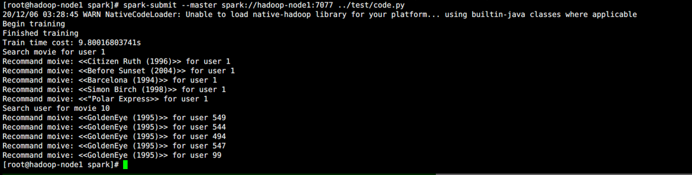

# movie-recommendation


## 下载镜像
* 镜像中已包含pyspark代码: /usr/local/test/code.py
```
docker pull wavey/moive-recommendation:latest
```
##  启动多个容器及内部的hdfs与spark
* 该脚本会基于上述镜像启动3个容器，并进行HDFS启动、上传数据到HDFS、启动spark等操作。
```
sh start_contrainer.sh
```
##  进入hadoop-node1 container后，运行代码
```
spark-submit --master spark://Hadoop-node1:7077 /usr/local/test/code.py
```

##  结果样例

